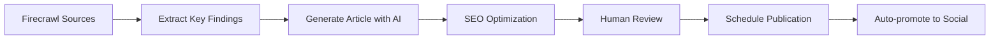

# Product Requirements Document (PRD) - Simplified Version
## Lotus Direct Care Website Redesign

**Version:** 2.0  
**Date:** January 2025  
**Author:** Product Strategy Team  
**Status:** Simplified Architecture

---

## Table of Contents

1. [Executive Summary](#executive-summary)
2. [Project Overview](#project-overview)
3. [Business Objectives](#business-objectives)
4. [Technical Architecture](#technical-architecture)
5. [Core Features](#core-features)
6. [AI Blog Automation](#ai-blog-automation)
7. [SEO Requirements](#seo-requirements)
8. [Design Requirements](#design-requirements)
9. [Integration Requirements](#integration-requirements)
10. [Success Metrics](#success-metrics)
11. [Timeline](#timeline)

---

## 1. Executive Summary

### Project Vision
Create a streamlined, SEO-optimized website that establishes Lotus Direct Care as the premier functional medicine direct primary care practice in Wisconsin, leveraging AI-powered content generation for thought leadership while maintaining simplicity through external service integrations.

### Key Simplifications
- **No HIPAA Compliance Required**: All patient data handled through external systems
- **External Scheduling**: Direct links to Elation EMR and Hint Health
- **Lead Capture Only**: Website handles only prospective patient information
- **AI Content Engine**: Automated blog generation for SEO dominance
- **Lightweight Architecture**: Focus on performance and conversion

### Expected Outcomes
- Dominate organic search for functional medicine keywords
- Generate 50+ qualified leads monthly
- Establish thought leadership through AI-powered content
- Maintain 15%+ conversion rate for lead capture
- Build sustainable organic traffic growth

---

## 2. Project Overview

### 2.1 Simplified Architecture

```
Website Functions:
- Marketing & Education (Public)
- Lead Capture (Prospective Patients)
- SEO & Content (AI-Powered)

External Systems (Linked):
- Hint Health (Membership Signup)
- Elation EMR (Appointment Booking)
- Elation Passport (Patient Portal)
- Mailchimp (Email Marketing via Webhook)
```

### 2.2 Technology Stack

#### Frontend
- **Framework**: Next.js 14+ with App Router
- **UI Components**: Shadcn UI
- **Styling**: Tailwind CSS
- **Language**: TypeScript

#### Backend
- **AI Blog System**: Node.js + Express
- **Content Gathering**: Firecrawl API
- **AI Generation**: Claude/OpenAI/Gemini APIs
- **Database**: PostgreSQL (for blog content)
- **Webhooks**: Zapier integration

#### Infrastructure
- **Hosting**: Vercel or AWS
- **CDN**: Cloudflare
- **Analytics**: GA4 + GTM

---

## 3. Business Objectives

### 3.1 Primary Objectives

1. **SEO Dominance**
   - Rank #1 for "functional medicine mequon/milwaukee"
   - Generate 1000+ organic visitors/month within 6 months
   - Publish 2-3 AI-generated articles weekly

2. **Lead Generation**
   - Capture 50+ qualified leads monthly
   - Maintain 15%+ conversion rate
   - Automate lead nurturing via Mailchimp

3. **Thought Leadership**
   - AI-powered content from medical journals
   - Evidence-based articles on functional medicine
   - Build authority in longevity and integrative medicine

---

## 4. Technical Architecture

### 4.1 Simplified System Design

```
┌─────────────────────────────────────────────────────────┐
│                   Public Website                         │
│           Next.js + Shadcn UI + Tailwind               │
├─────────────────────────────────────────────────────────┤
│                    Core Pages                           │
│  Home | About | Services | Blog | Contact | Resources  │
├─────────────────────────────────────────────────────────┤
│                 Lead Capture Forms                      │
│          Webhook → Zapier → Mailchimp                  │
├─────────────────────────────────────────────────────────┤
│              AI Blog Automation System                  │
│   Firecrawl → Claude/OpenAI → Content Generation       │
└─────────────────────────────────────────────────────────┘
                            │
                    External Links To:
              ┌─────────────┴──────────────┐
              │                            │
        Hint Health              Elation EMR
        (Signup)                (Scheduling)
```

### 4.2 Database Schema (Simplified)

```sql
-- Blog posts generated by AI
CREATE TABLE blog_posts (
  id UUID PRIMARY KEY DEFAULT gen_random_uuid(),
  title VARCHAR(255) NOT NULL,
  slug VARCHAR(255) UNIQUE NOT NULL,
  content TEXT NOT NULL,
  excerpt TEXT,
  meta_description VARCHAR(160),
  keywords TEXT[],
  author VARCHAR(100) DEFAULT 'Dr. Aaron Rosenberg',
  status VARCHAR(20) DEFAULT 'draft',
  source_urls TEXT[],
  ai_model VARCHAR(50),
  created_at TIMESTAMP DEFAULT CURRENT_TIMESTAMP,
  published_at TIMESTAMP,
  updated_at TIMESTAMP DEFAULT CURRENT_TIMESTAMP
);

-- Lead capture tracking
CREATE TABLE leads (
  id UUID PRIMARY KEY DEFAULT gen_random_uuid(),
  email VARCHAR(255) NOT NULL,
  first_name VARCHAR(100),
  last_name VARCHAR(100),
  phone VARCHAR(20),
  interest VARCHAR(255),
  source VARCHAR(100),
  created_at TIMESTAMP DEFAULT CURRENT_TIMESTAMP
);

-- AI content sources
CREATE TABLE content_sources (
  id UUID PRIMARY KEY DEFAULT gen_random_uuid(),
  name VARCHAR(255) NOT NULL,
  url VARCHAR(500) NOT NULL,
  type VARCHAR(50), -- journal, blog, news
  last_crawled TIMESTAMP,
  is_active BOOLEAN DEFAULT true
);
```

---

## 5. Core Features

### 5.1 Homepage
- **Hero Section**: Compelling headline with lead capture form
- **Value Props**: Three pillars of care
- **Services Preview**: Cards linking to service pages
- **Recent Blog Posts**: AI-generated content showcase
- **Trust Signals**: LegitScript badge, Google reviews
- **CTAs**: "Schedule Free Consultation" → Elation link

### 5.2 Service Pages
- Functional Medicine
- Direct Primary Care
- Integrative Therapies
- Longevity Medicine
- Addiction Medicine

Each page includes:
- Educational content
- Benefits
- Lead capture form
- Link to schedule consultation

### 5.3 About Section
- Dr. Rosenberg bio
- Philosophy of care
- Credentials (IFM certification)
- Practice approach

### 5.4 Contact/Lead Capture
- Simple form (Name, Email, Phone, Interest)
- Webhook to Zapier
- Auto-response via Mailchimp
- No PHI collected

### 5.5 External Links Hub
- "Current Patients" → Elation Passport login
- "Schedule Appointment" → Elation booking
- "Become a Member" → Hint Health signup

---

## 6. AI Blog Automation

### 6.1 Architecture

```javascript
// AI Blog System Overview
const aiBlogSystem = {
  // Content Discovery
  discovery: {
    tool: 'Firecrawl',
    sources: [
      'pubmed.ncbi.nlm.nih.gov',
      'jamanetwork.com',
      'nejm.org',
      'functionalmedicine.org',
      'nature.com/subjects/longevity'
    ],
    frequency: 'daily',
    topics: [
      'functional medicine',
      'longevity research',
      'integrative health',
      'microbiome',
      'metabolic health'
    ]
  },
  
  // Content Generation
  generation: {
    models: ['Claude 3', 'GPT-4', 'Gemini'],
    style: 'Dr. Rosenberg voice',
    length: '1500-2000 words',
    seo_optimized: true
  },
  
  // Publishing Pipeline
  pipeline: {
    draft_creation: 'automatic',
    review_required: true,
    seo_check: 'automatic',
    publishing: 'scheduled'
  }
};
```

### 6.2 Admin Dashboard Features

```typescript
interface AIBlogDashboard {
  // Content Queue
  queue: {
    scheduled: BlogPost[];
    drafts: BlogPost[];
    ideas: ContentIdea[];
  };
  
  // Source Management
  sources: {
    add: (url: string, type: SourceType) => void;
    remove: (id: string) => void;
    crawlFrequency: CrawlSchedule;
  };
  
  // AI Settings
  aiConfig: {
    model: 'claude' | 'openai' | 'gemini';
    tone: 'professional' | 'conversational';
    targetKeywords: string[];
    avoidTopics: string[];
  };
  
  // Analytics
  performance: {
    organicTraffic: ChartData;
    topPosts: BlogPost[];
    keywordRankings: KeywordData[];
  };
}
```

### 6.3 Content Generation Workflow



---

## 7. SEO Requirements

### 7.1 Technical SEO
- Server-side rendering with Next.js
- Automatic sitemap generation
- Schema markup for medical practice
- Core Web Vitals optimization
- Mobile-first indexing

### 7.2 Content SEO
- AI-generated blog posts 2-3x weekly
- Location-specific service pages
- Condition-specific landing pages
- Internal linking strategy
- Meta descriptions for all pages

### 7.3 Local SEO
- Google My Business optimization
- Local schema markup
- City-specific landing pages
- NAP consistency
- Review integration

---

## 8. Design Requirements

### 8.1 UI Framework
- **Component Library**: Shadcn UI
- **Styling**: Tailwind CSS
- **Animations**: Framer Motion
- **Icons**: Lucide React

### 8.2 Design Principles
- Clean, medical aesthetic
- Mobile-first responsive
- High contrast for accessibility
- Trust-building elements prominent
- Fast-loading, minimal JavaScript

### 8.3 Key Components
```tsx
// Example Shadcn UI implementation
import { Button } from "@/components/ui/button"
import { Card } from "@/components/ui/card"
import { Form } from "@/components/ui/form"

// Lead capture form component
<Card className="p-6">
  <Form onSubmit={handleLeadCapture}>
    <Input name="email" type="email" required />
    <Input name="firstName" placeholder="First Name" />
    <Input name="phone" type="tel" />
    <Select name="interest">
      <SelectItem value="functional">Functional Medicine</SelectItem>
      <SelectItem value="membership">Membership Info</SelectItem>
    </Select>
    <Button type="submit" size="lg" className="w-full">
      Get Started
    </Button>
  </Form>
</Card>
```

---

## 9. Integration Requirements

### 9.1 Webhook Integration (Zapier)
```javascript
// Lead capture webhook
app.post('/api/webhook/lead', async (req, res) => {
  const leadData = req.body;
  
  // Send to Zapier
  await fetch(process.env.ZAPIER_WEBHOOK_URL, {
    method: 'POST',
    headers: { 'Content-Type': 'application/json' },
    body: JSON.stringify({
      email: leadData.email,
      firstName: leadData.firstName,
      lastName: leadData.lastName,
      phone: leadData.phone,
      interest: leadData.interest,
      source: 'website',
      timestamp: new Date().toISOString()
    })
  });
  
  res.json({ success: true });
});
```

### 9.2 External Service Links
```javascript
const externalLinks = {
  patientSignup: 'https://lotusdirectcare.hint.com/signup/membership/contacts',
  patientScheduling: 'https://app.elationemr.com/book/lotusdirectcare?appointment_types=',
  meetAndGreet: 'https://app.elationemr.com/book/lotusdirectcare/service-locations/933212881617143?appointment_types=',
  patientPortal: 'https://app.elationpassport.com/passport/login/'
};
```

### 9.3 AI API Integration
```javascript
// Claude API integration for blog generation
import Anthropic from '@anthropic-ai/sdk';

const anthropic = new Anthropic({
  apiKey: process.env.CLAUDE_API_KEY,
});

async function generateBlogPost(research: string, keywords: string[]) {
  const response = await anthropic.messages.create({
    model: 'claude-3-opus-20240229',
    max_tokens: 4000,
    messages: [{
      role: 'user',
      content: `Generate a blog post in Dr. Rosenberg's voice about functional medicine. 
                Use this research: ${research}
                Target keywords: ${keywords.join(', ')}
                Length: 1500-2000 words
                Style: Evidence-based, accessible, authoritative`
    }]
  });
  
  return response.content;
}
```

---

## 10. Success Metrics

### 10.1 Primary KPIs
- **Organic Traffic**: 1000+ monthly visitors within 6 months
- **Lead Generation**: 50+ qualified leads monthly
- **Conversion Rate**: 15%+ for lead capture forms
- **Blog Performance**: 2-3 posts weekly, 3+ minute average read time
- **Search Rankings**: Page 1 for primary keywords

### 10.2 Secondary Metrics
- Email list growth rate
- Social media engagement
- Blog post shares
- Time on site
- Pages per session

---

## 11. Timeline

### Phase 1: Foundation (Weeks 1-2)
- Set up Next.js + Shadcn UI
- Create core pages
- Implement lead capture forms
- Set up Zapier webhooks

### Phase 2: Content & SEO (Weeks 3-4)
- Launch AI blog system
- Configure Firecrawl sources
- Create initial blog posts
- Implement SEO optimizations

### Phase 3: Launch (Week 5)
- Final testing
- Analytics setup
- Go live
- Monitor performance

### Phase 4: Optimization (Ongoing)
- A/B test lead forms
- Refine AI content generation
- Expand keyword targeting
- Scale content production

---

## Summary

This simplified architecture achieves all business goals while:
1. **Eliminating complexity** through external service integration
2. **Focusing on SEO** with AI-powered content
3. **Maximizing conversions** with streamlined lead capture
4. **Maintaining security** by not handling patient data
5. **Enabling scale** through automation

The website becomes a powerful marketing and education platform that drives growth while keeping technical complexity minimal.